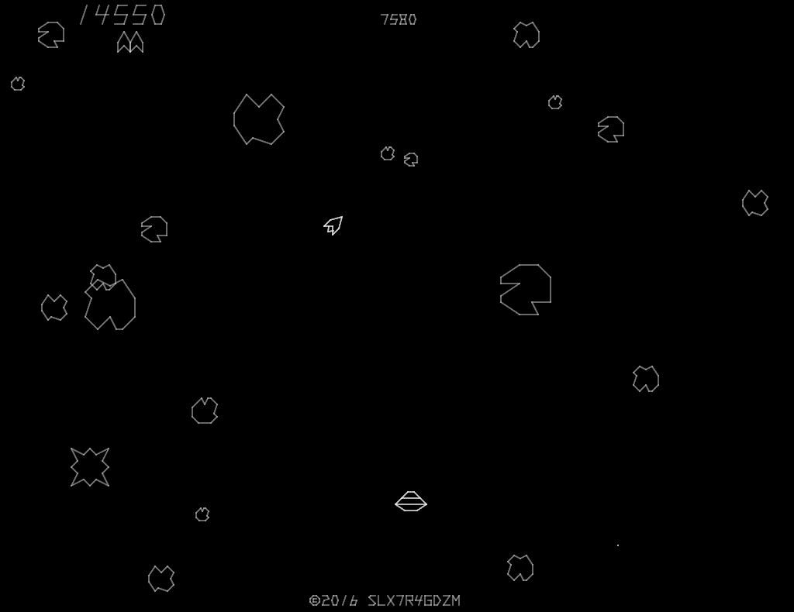
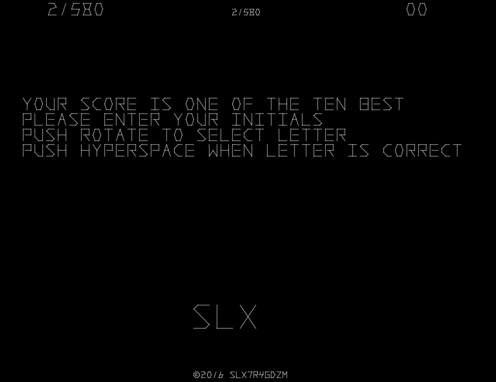

# Sine

Sine is an unfinished remake of Asteroids that I've made using HolyC.

## Screenshots

| In-game                                                | High score entry                                                                                |
|--------------------------------------------------------|-------------------------------------------------------------------------------------------------|
|  |  |

## Download

An ISO image for TempleOS can be found [here](https://github.com/slx7R4GDZM/Sine/releases).

## Default controls

| Action         | Key              |
|----------------|------------------|
| 1 Player Start | <kbd>1</kbd>     |
| 2 Player Start | <kbd>2</kbd>     |
| Rotate Left    | <kbd>A</kbd>     |
| Rotate Right   | <kbd>D</kbd>     |
| Thrust         | <kbd>W</kbd>     |
| Fire Photon    | <kbd>E</kbd>     |
| Hyperspace     | <kbd>Space</kbd> |
| Left Coin      | <kbd>🡨</kbd>     |
| Center Coin    | <kbd>🡫</kbd>     |
| Right Coin     | <kbd>🡪</kbd>     |
| Resize Window  | <kbd>F5</kbd>    |
| Exit           | <kbd>Esc</kbd>   |

## Running

After inserting the ISO image, you can run it from the disc:

    Cd("T:/Sine");
    #include "Main";

Or you can copy the directory to disk to run it:

    CopyTree("T:", ".");
    Cd("Sine");
    #include "Main";

## Running at 60 FPS

This will make TempleOS 60 FPS, but it might break other programs.

1. Open ```C:/Kernel/KernelA.HH```.
2. Assuming TempleOS 5.030, go to line 1478.
3. For ```WINMGR_FPS``` and ```WINMGR_PERIOD``` change 30000.0 to 60000.0.
4. Reboot TempleOS.

## What's with the strange constants?

The vector and text constants were made with [Sine Toolkit](https://github.com/slx7R4GDZM/Sine-Toolkit).

## License information

This project is licensed under the terms of the [MIT License](License.TXT).
