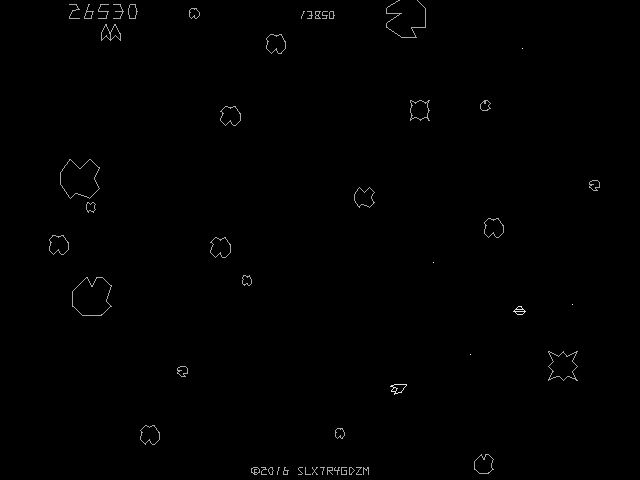
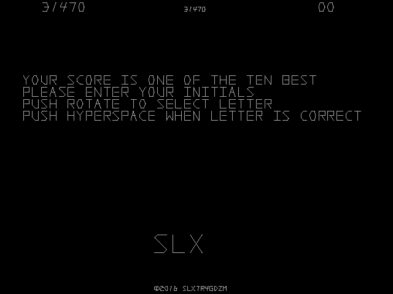

# Sine
Sine is an unfinished remake of Asteroids that I've made using C++ and [SFML](https://github.com/SFML/SFML).

## Screenshots
| In-game                                                          | High score entry                                                                                                   |
| ---------------------------------------------------------------- | ------------------------------------------------------------------------------------------------------------------ |
|  |  |

## Download
The compressed source and a prebuilt Windows binary can be found [here](https://github.com/slx7R4GDZM/Sine/releases).

## Default Controls
| Action         | Key              |
| -------------- | ---------------- |
| 1 Player Start | <kbd>1</kbd>     |
| 2 Player Start | <kbd>2</kbd>     |
| Rotate Left    | <kbd>A</kbd>     |
| Rotate Right   | <kbd>D</kbd>     |
| Thrust         | <kbd>W</kbd>     |
| Fire Photon    | <kbd>E</kbd>     |
| Hyperspace     | <kbd>Space</kbd> |
| Left Coin      | <kbd>🡨</kbd>     |
| Center Coin    | <kbd>🡫</kbd>     |
| Right Coin     | <kbd>🡪</kbd>     |
| Fullscreen     | <kbd>F11</kbd>   |
| Exit           | <kbd>Esc</kbd>   |

## Compiling
Sine was designed to compile with SFML 2.4.2 under MinGW-w64 7.1.0 POSIX Threads using the C++14 flag.

## What's with the Strange Constants?
The vector and text constants were made with [Sine Toolkit](https://github.com/slx7R4GDZM/Sine-Toolkit).

## License Information
This project is licensed under the terms of the [MIT License](License.txt).  
SFML is licensed under the terms of the [zlib/png license](https://www.sfml-dev.org/license.php).
